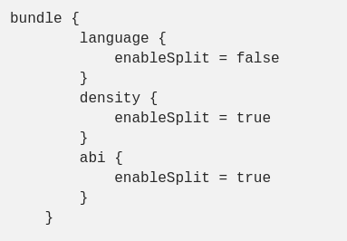
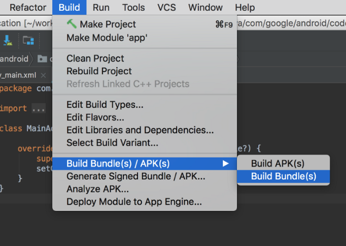

# App Bundles-Dynamic Deliver
# Phần 1: App Bundles
- App Bundles là một định dạng upload mới bao gồm tất cả các code và resource được compile từ app, không tạo APK.
- Publish với App Bundle cũng tăng giới hạn kích thước app lên 150MB mà không cần phải sử dụng APK. Đó là kích thước tải xuống chứ không phải kích thước xuất bản.
## Lợi ích của App Bundle
- Dynamic Delivery: Kích thước APK nhỏ hơn.
- Không cần tạo và quản lý thủ công nhiều APK
- Dynamic Feature Module (Phân phối động): Cho phép người dùng tải xuống và cài đặt thêm các tính năng khi có yêu cầu. Điều này cho phép chúng ta làm giảm kích thước ban đầu của app. Các tính năng này nằm ở các module khác nhau và sử dụng thư viện <b>Play Core Library</b> để tải xuống các module này.
- Support Instant App: Người dùng có thể chạy các feature module mà không cần phải cài đặt app. Tham khảo Instant App 
  <a href="https://viblo.asia/p/android-instant-app-buoc-dot-pha-cho-trai-nghiem-nguoi-dung-XL6lAA0mlek">Tại đây</a>

## Định dạng App Bundle
- App Bundle là một file (có phần mở rộng .aab, không thể cài đặt trên device) mà bản upload lên Google Play để được support *Dynamic Delivery*.
- App Bundle là các tệp nhị phân được ký kết, sắp xếp code và resource trong module.

- Các phần được tô màu xanh như drawable, values, lib đại diện cho code và resource mà Google Play sử dụng để tạo APK cấu hình cho từng Module.
- Chi tiết:
	+ base/, feature1/, feature2/: Đại diện cho một module khác nhau của app.
  	+ BUNDLE-METADATA/: Thư mục này bao gồm các file metadata chứa các thông tin tools và app stores.
  	+ Module Protocol Buffer(.pb): Các file này cung cấp metadata để mô tả nội dung của từng module cho app store.Ví dụ: *BundleConfig.pb* cung cấp thông tin của chính nó chẳng hạn như version nào của các tool được sử dụng để xây dựng app bundle *native.pb*, *resources.pb* (resource.arac trong APK) mô tả code và resources trong mỗi module, *assets.pb* sẽ chỉ sử dụng khi bạn đang sử dụng tài nguyên trong app.
  	+ manifest/: *app bundle* sẽ lưu trữ các file AndroidManifest.xml của mỗi module trong thư mục riêng này.
  	+ dex/: *app bundle* sẽ lưu trữ các file DEX cho mỗi module trong thư mục riêng này.
  	+ res/, lib/, assets/: Giống trong APK.
  	+ root/: Dùng để lưu trữ file root của bất kỳ APK có chứa module mà thư mục này được đặt.
- *Cẩn thận*: Nếu nội dung trong các file *root* xung đột với các file và thư mục khác trong root APK, Play Console sẽ từ chối toàn bộ app bundle gửi lên . Ví dụ: root/lib nó sẽ xung đột với thư mục lib đã tồn tại trong mỗi APK.
- *Note*: Nếu sử dụng *product flavor* để tạo nhiều version cho app từ một app project và mỗi version sử dụng applicationID duy nhất, bạn cần phải tạo một App Bundle riêng biệt cho từng version.

## Building và Distributing App Bundle
- Config:

	

- Bấm *Run* để build và deploy app trên device. 
- *Note*: Android Studio yêu cầu AAPT2 để build *app bundle* (mặc định được bật cho các project mới). Để đảm bảo nó được bật trên project hiện có, thêm *android.enableAapt2=true* trong *gradle.properties* và restart lại Gradle bằng *./gradlew --stop* từ command line.

- Generate *App Bundle* bằng cách sử dụng Android Studio từ 3.2 trở lên hoặc Console *./gradlew bundle*.
- *App Bundle* được tạo ra sẽ lưu trữ trong *app/build/outputs/bundle/buildVariant/bundle.aab*
- Khi build *app bundle*, mặc định tất cả các phân tách sẽ được generate. Ta có thể thiết lập những phần nào sẽ được đóng gói vào APK bằng cách sử dụng khối bundle{} trong khối android{}
	

## Bundle tool
- Là công cụ mà Gradle, Android Studio, Google Play sử dụng để xây dựng *App Bundle* hoặc chuyển đổi *App Bundle* thành APK triển khai trên device.
### Generate APKs từ App Bundle
- Generate apks từ *app bundle*: *java -jar ./bundletool-all-0.10.0.jar build-apks --bundle=./app.aab --output=./out.apks*

- Cài vào device: *java -jar ./bundletool-all-0.10.0.jar install-apks --apks=./out.apks*

### Generate APKs cho một device cụ thể

- Nếu không muốn build một bộ APk cho tất cả các cấu hình device, có thể tạo APK nhắm mục tiêu cấu hình thiết bị cụ thể.
	+ Thiết bị được kết nối: *java -jar ./bundletool-all-0.10.0.jar  build-apks --connected-device --bundle=./app.aab --output=./out_specific.apks*
	

	+ Sử dụng tệp Json mô tả cấu hình device: java -jar ./bundletool-all-0.10.0.jar  build-apks --device-spec=./pixel1.json --bundle=./app.aab --output=./out_specific_json.apks
	

# Phần 2: Dynamic Deliver
- Mô hình phục vụ ứng dụng Google Play, sử dụng *App Bundle* để tạo ra APK nhỏ hơn, tối ưu hóa cho từng cấu hình device. Vì vậy, người dùng chỉ cần download code và resouces cần thiết để chạy app. Bạn không cần phải xây dựng và quản lý nhiều APK để hỗ trợ cho các device khác nhau nữa.

## Dynamic Deliver với split APKs.
- *split APK* là một thành phần cơ bản của *Dynamic Deliver* có sẵn từ Android 5.0 (API level 21) - cơ chế phân tách APK, nó bao gồm *DEX bytecode* được biên dịch, *resources* và *Android manifest*. Có thể cài đặt nhiều *split APK* và nó xuất hiện như app được cài đặt trên device.

- Lợi ích của *split APK* là các APK này nhỏ hơn, tối ưu hơn với từng cấu hình device mà có đầy đủ chức năng cần thiết cho người dùng, và người dùng có thể cài đặt các gói riêng biệt nếu cần.
	+ Base APK: Là những phần chung cho tất cả các cấu hình thiết bị như là manifest, dex, ngôn ngữ và bất kỳ phần nào giống nhau cho tất cả device.
- Các loại APK
	+ Configuration APKs: Chỉ chứa các thư viện và resources cho một cấu hình thiết bị nhất định, tối ưu hóa nội dung APK dựa theo: ngôn ngữ, mật độ màn hình, kiến trúc CPU.
	+ Dynamic Feature APKs: Chứa code và resources cho một feature, không bắt buộc khi cài app lần đầu tiên nhưng có thể được cài đặt sau khi người dùng yêu cầu.
- Cách hoạt động:

	+ Ví dụ: Khi user device có cấu hình: x86, hdpi, en thì APK tương ứng là (base + x86 + hdpi + en).apk
	+ Nếu nguời dùng thay đổi cấu hình device ở thời điểm nào đó (chẳng hạn như thay đổi ngôn ngữ), PlayStore sẽ nhận ra điều này và sẽ tải xuống các phần chia cấu hình mới cho tất cả các ứng dụng sử dụng *split APK* trên thiết bị. Nếu device không có internet thì nó sẽ tải xuống sau.
- Đối với các device dưới Android 5.0 không hỗ trợ tải xuống và cài đặt *split APKs*, Google Play sẽ thay thế nó bằng một APK duy nhất gọi là multi-APK. Thay vì chia tách ra, APK độc lập sẽ được tạo phù hợp với ma trận kết hợp các kiến trúc và mật độ thiết bị khác nhau. Theo cách tiếp cận này thì tất cả các ngôn ngữ sẽ nằm trong APK vì ma trận sẽ trở nên quá lớn khi kết hợp.
	

## Dynamic feature module

## Tham khảo
- https://developer.android.com/guide/app-bundle
- https://medium.com/google-developer-experts/exploring-the-android-app-bundle-ca16846fa3d7
- https://medium.com/mindorks/android-app-bundle-6c65ce8105a1
- https://viblo.asia/p/gioi-thieu-ve-android-app-bundle-m68Z00r6ZkG
- https://viblo.asia/p/co-ban-ve-android-app-bundle-ByEZkNdqKQ0
